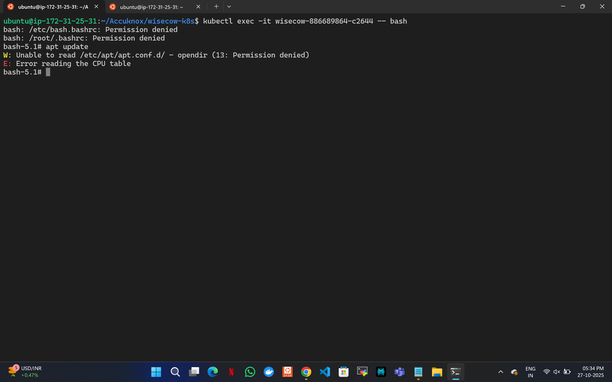
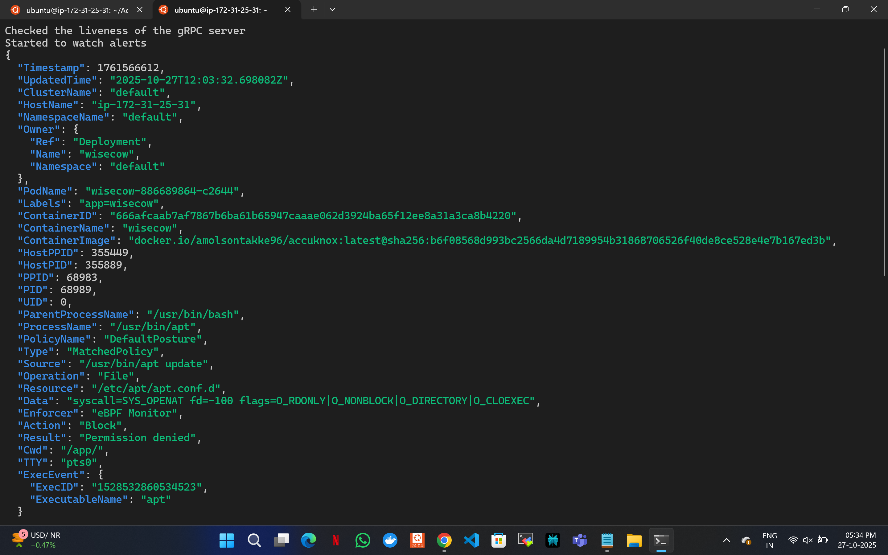

## Problem statement-1
# Cow wisdom web server

## Prerequisites

Make sure you have the following installed and configured:


- Kubernetes cluster (local or cloud)
- kubectl configured to communicate with the cluster
- docker install

1 Run the following command to create key and certificate

```bash
openssl req -x509 -nodes -days 365 \
  -newkey rsa:2048 \
  -keyout tls.key \
  -out tls.crt \
  -subj "/CN=wisecow.local/O=wisecow"
```

2 Run the following command to create secret

```bash
kubectl create secret tls wisecow-tls --key tls.key --cert tls.crt
```

## 🔁 Clone the Git Repository

First, clone the Github repository:

```bash

git clone https://github.com/amolsontakke96/Accuknox

cd Accuknox

```

4 Deploy kubernetes manifest file from the local Accuknox/wisecow-k8s directory:

```bash
kubectl apply -f deployment.yaml
kubectl apply -f service.yaml
kubectl apply -f ingress.yaml
```

## ✅ Verify the Deployment

```bash
Check Pods

kubectl get pods

```

## ✅ Verify the services

```bash
Check Services

kubectl get svc
```

## ✅ Verify the ingress

```bash
Check ingress

kubectl get ingress
```

## ✅ Install NGINX Ingress Controller via Helm

1 Add the Ingress NGINX Controller Helm repository

```bash
helm repo add ingress-nginx https://kubernetes.github.io/ingress-nginx
helm repo update
```
2 Install the Ingress Controller


Use the following command to install it in the ingress-nginx namespace:

```bash

helm install ingress-nginx ingress-nginx/ingress-nginx \
  --namespace ingress-nginx \
  --create-namespace \
  --set controller.hostNetwork=true
```
3 Verify the Installation

Check that the controller pod is running:

```bash
kubectl get pods -n ingress-nginx

```
```bash
Add the following line
add <vm-public-ip> wisecow.local this line in /etc/hosts to access on localhost
```

3 Run command to check if TLS is working

```bash
curl -k https://wisecow.local/
```
## 🌐 wisecow web Services

Web UI Access
```bash
curl -I https://wisecow.local/

```

# CI/CD Pipeline

## cd .github/workflows/main.yml
## Store secrets in github repository
```bash
DOCKERHUB_USERNAME
DOCKERHUB_PASSWORD
KUBE_CONFIG_DATA
```
## Encode and add KUBE_CONFIG_DATA in secrets

```bash
cat ~/.kube/config | base64 -w0
```
## Problem statement-2


## Prerequisites

Make sure you have the following installed and configured:


- python
- pip
- virtual environment
- python packages

## Install Python Packages

```bash
pip install psutil
pip install requests
```

## 🔁 Clone the Git Repository

First, clone the Github repository:

```bash

git clone https://github.com/amolsontakke96/Accuknox

cd Accuknox/scripts
```
## Create python virtual environment

```bash
python3 -m venv venv

```

## start the virtual environment

```bash
source venv/bin/activate
```

## Run the Scripts

```bash
python Application_health_checker.py
python monitor_health_linux_system.py
```

## To check logs

```bash
cat logs/application_health.log
cat logs/system_health.log
```


## problem statement-3


## Deploy kube armor

```bash
helm repo add kubearmor https://kubearmor.github.io/charts
helm repo update kubearmor
helm upgrade --install kubearmor-operator kubearmor/kubearmor-operator -n kubearmor --create-namespace
kubectl apply -f https://raw.githubusercontent.com/kubearmor/KubeArmor/main/pkg/KubeArmorOperator/config/samples/sample-config.yml
```
## install Kubearmor cli to check logs
```bash
curl -sfL http://get.kubearmor.io/ | sudo sh -s -- -b /usr/local/bin
```
## Check logs in Kubearmor
```bash
karmor logs --json
```
check kubearmor pods

```bash
kubectl get pods -n kubearmor
```
## Apply Kubearmor zero trust policy

## 🔁 Clone the Git Repository

First, clone the Github repository:

```bash

git clone https://github.com/amolsontakke96/Accuknox

cd Accuknox/wisecow-k8s
```

Deploy kubernetes manifest file for kubearmor zero trust policy from Accuknox/wisecow-k8s directory:

```bash
kubectl apply -f zero-trust-policy.yaml
```

Check the kubearmor policy

```bash
kubectl get kubearmorpolicy
```

Running Update command inside pod



Running Error logs in kubearmor 


